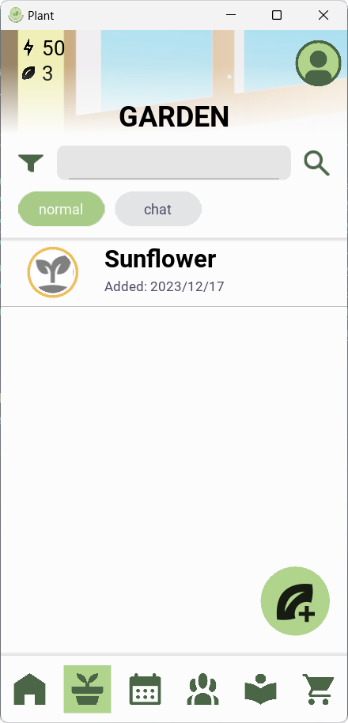

#  Plant Reminder

Front-end Elements for the Plant Reminder App 🪴 (My Uni's Compulsory Startup Project)

Functionalities include: 
- Keep track of plants with weekly care calendar and alarms for each care task
- Automatic information overview and personalized calendar creation with ChatGPT
- Virtual pet interaction with each plant using ChatGPT, diversed personality
- Detailed plant information lookup from Vietnam Plant Data Center (VPDC)
  
Server is down so all functions are down. Only Windows port is usable (as in, start the screen). Android version is totally broken.

## Screenshot

### Main screen
 

### Functionalities
- Plants management

  
- Search from VPDC

 

