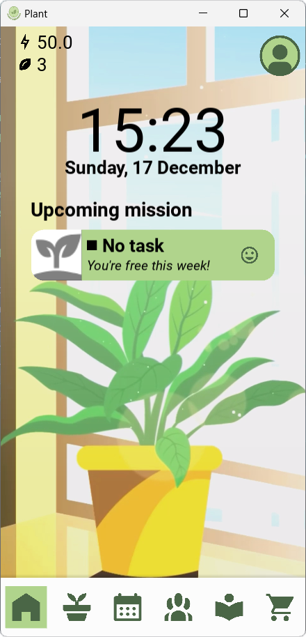

#  Plant Reminder

Front-end Elements for the Plant Reminder App 🪴 (My Uni's Compulsory Startup Project)

## Features 
- Keep track of plants with weekly care calendar and notification for each care task
- Automatic information overview and smart calendar creation with ChatGPT
- Virtual pet interaction with each plant using ChatGPT, diversed personality
- Detailed plant information lookup from Vietnam Plant Data Center (VPDC)
  
## Status

Server is down so all functions are down. Only Windows port is usable (as in, start the screen). Android version is totally broken.

## Screenshot

### Main screen
 

### Functionalities
- Plants management

   
- Calendar and Virtual pet

  
- Search from VPDC

 

